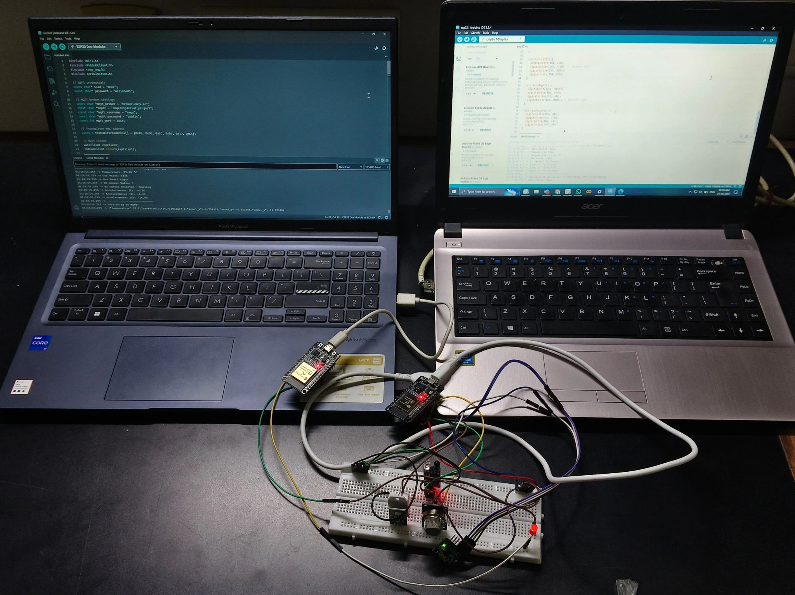
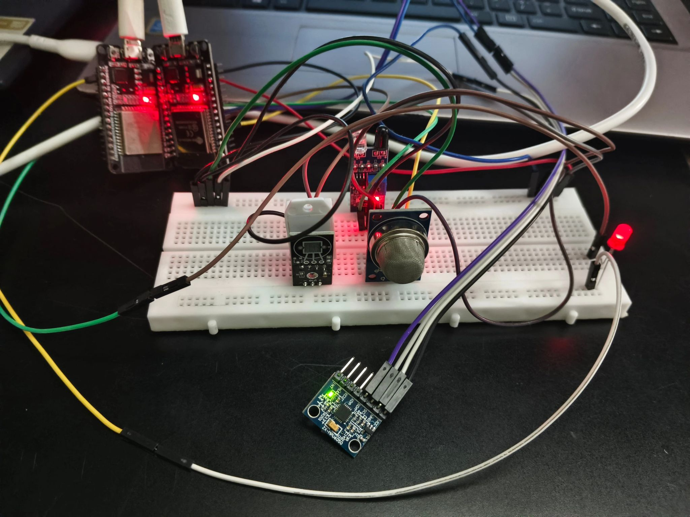

# Smart Helmet IoT

An ESP32-based, multi-node safety monitoring system for underground mine workers, built on ESP-NOW mesh communication and MQTT cloud publishing.

---

## Table of Contents

- [Overview](#overview)
- [Problem Statement](#problem-statement)
- [System Architecture](#system-architecture)
- [Hardware](#hardware)
- [Data Packet Specification](#data-packet-specification)
- [Alert Logic and Thresholds](#alert-logic-and-thresholds)
- [Repository Structure](#repository-structure)
- [Firmware Setup](#firmware-setup)
- [MQTT Topic Structure](#mqtt-topic-structure)
- [Design Notes and Known Limitations](#design-notes-and-known-limitations)
- [Possible Extensions](#possible-extensions)
- [Acknowledgements](#acknowledgements)

---

## Overview

This repository contains the complete embedded firmware and system documentation for a Smart Helmet prototype. Each helmet is an independent sensing node that continuously monitors its wearer's immediate environment (temperature, humidity, air quality) and physical state (motion, fall detection, helmet-worn status), and relays this data over a wireless mesh to a gateway node that publishes it to an MQTT broker for remote monitoring.

The system is explicitly designed around the constraint that underground mines do not reliably provide WiFi or cellular connectivity at the point of work. Communication between helmets and the mine entrance is handled entirely over ESP-NOW, a connectionless, low-latency protocol that does not require an access point. Only the outermost gateway node requires WiFi.

---

## Problem Statement

Underground mining environments present several concurrent risks that are difficult to monitor manually:

- Buildup of harmful or asphyxiant gases without perceptible warning signs.
- Falls, collisions, or loss of consciousness that may go unnoticed for extended periods.
- Non-compliance with PPE (helmets removed due to heat or discomfort).
- Absence of network infrastructure at the depth where workers are actually located.

This system addresses each of these by pushing detection and alerting to the edge (the helmet itself triggers a local buzzer immediately, with zero dependency on network availability), while still forwarding the same data to a control room via a relay chain for centralized visibility.

---

## System Architecture

The system uses a three-tier, dual-master relay topology:

```
Minor Helmet 1 ---\
Minor Helmet 2 ----+--ESP-NOW-->  MASTER 1 (in-mine relay)  --ESP-NOW-->  MASTER 2 (surface gateway)  --MQTT-->  Broker / Dashboard
Minor Helmet 3 ---/
```

| Tier | Firmware file | Deployment location | Network dependency | Responsibility |
|---|---|---|---|---|
| Minor Helmet | `minor-helmet/minor_helmet.ino` | Worn by each worker | None (ESP-NOW only) | Reads sensors, evaluates local alert conditions, transmits data packet to Master 1 every 2 seconds |
| Master 1 | `master1-inmine/master1_inmine.ino` | Fixed position inside the mine, within ESP-NOW range of active helmets | None (ESP-NOW only) | Receives packets from all helmets, forwards each packet unmodified to Master 2 |
| Master 2 | `master2-gateway/master2_gateway.ino` | Fixed position at the mine entrance or surface, within WiFi range | WiFi and MQTT | Receives packets from Master 1, serializes each to JSON, publishes to the broker under a per-helmet topic, and drives a local alert output |

Rationale for the two-master split: ESP-NOW's effective range is on the order of tens to a few hundred meters line-of-sight, and degrades further underground due to obstruction. A single node cannot simultaneously stay within ESP-NOW range of the workers and within WiFi range of the surface. Splitting the relay into an in-mine hop and a surface hop resolves this without requiring WiFi infrastructure underground. The relay chain is extensible: additional in-mine relay nodes (Master 1B, 1C, and so on) can be inserted between Master 1 and Master 2 for longer mine shafts without any change to the helmet firmware, provided the same packet structure is preserved end to end.

Full setup and configuration instructions are documented in `docs/ARCHITECTURE.md`.

<p align="center">
  
  <br>
  <sub>Figure 1. Development bench setup. Two ESP32 boards running transmitter and receiver firmware. Left monitor shows the receiver's serial output, including live sensor readings and the resulting MQTT publish payload. Right monitor shows the transmitter sketch open in Arduino IDE.</sub>
</p>

---

## Hardware

### Bill of Materials (per helmet node)

| Component | Interface | Notes |
|---|---|---|
| ESP32 Dev Module | - | Primary MCU for all three node roles |
| DHT22 | Single-wire digital | Temperature and humidity |
| MQ135 | Analog | Air quality / gas concentration; requires a warm-up period after power-on for stable readings |
| MPU6050 | I2C | Three-axis accelerometer, used for fall/impact detection |
| IR obstacle sensor | Digital | Used as a proxy for helmet-worn detection |
| Piezo buzzer | Digital output | Local audible alert |

### Pin Mapping (`minor-helmet/minor_helmet.ino`)

| Signal | ESP32 GPIO |
|---|---|
| DHT22 data | GPIO 15 |
| MQ135 analog output | GPIO 34 |
| IR sensor output | GPIO 27 |
| Buzzer | GPIO 4 |
| MPU6050 | Default I2C pins (SDA/SCL) |

These pin assignments are fixed in firmware. If the physical wiring differs from the table above, update the corresponding `#define` in `minor_helmet.ino` before flashing.

<p align="center">
  
  <br>
  <sub>Figure 2. Sensor breadboard. From left to right: DHT22 temperature/humidity sensor, MQ135 gas sensor, MPU6050 accelerometer breakout, and IR obstacle sensor with a red status LED. Two ESP32 boards are visible at the top of the frame, corresponding to the Master 1 / Master 2 pair used during bench testing.</sub>
</p>

---

## Data Packet Specification

All three firmware files (`minor_helmet.ino`, `master1_inmine.ino`, `master2_gateway.ino`) declare and use an identical C struct for the ESP-NOW payload. This struct must remain byte-identical across all three files. ESP-NOW has no schema negotiation, and a mismatch will silently corrupt received data rather than raise an error.

```cpp
typedef struct struct_message {
  int     helmetID;        // Unique identifier of the originating helmet
  float   temperature;     // Degrees Celsius; 0 if DHT22 read failed
  int     gasValue;        // Raw analog reading from MQ135 (0-4095, 12-bit ADC)
  int     irValue;         // Digital state of IR sensor (HIGH = worn, LOW = not worn)
  int16_t ax, ay, az;      // Accelerometer readings, scaled by 1000 (divide by 1000.0 for m/s squared)
  bool    tempConnected;   // False if DHT22 is not physically present or responding
  bool    gasConnected;    // False if MQ135 is not physically present
  bool    irConnected;     // False if IR sensor is not physically present
  bool    mpuConnected;    // False if MPU6050 failed to initialize
} struct_message;
```

The `*Connected` flags exist so that a missing or disconnected sensor is reported as such, rather than silently producing a zero reading that could be misinterpreted as a valid measurement downstream.

Transmission interval: each minor helmet sends one packet every 2000 milliseconds (see `delay(2000)` in `minor_helmet.ino`). This interval is fixed in firmware and should be adjusted with care; decreasing it increases ESP-NOW channel traffic and MQTT publish rate proportionally across all active helmets.

---

## Alert Logic and Thresholds

Alert evaluation happens locally on each minor helmet, independent of network connectivity, so that the buzzer fires even if the relay chain to Master 2 is temporarily unavailable.

| Condition | Threshold (as shipped) | Constant in firmware |
|---|---|---|
| Gas concentration | gasValue greater than 1500 (raw ADC units) | `GAS_THRESHOLD` |
| Ambient temperature | temperature greater than 40.0 degrees Celsius | `TEMP_THRESHOLD` |
| Fall or impact | absolute value of ax, ay, or az greater than 15.0 m/s squared | `FALL_THRESHOLD` |
| Helmet not worn | IR sensor reads LOW | No separate constant; direct comparison |

Any one condition being true sets the buzzer output HIGH for that cycle. These thresholds are placeholder values suitable for bench testing and must be recalibrated against the actual MQ135 sensor's load-resistance and calibration curve, and against site-specific safety limits, before any field deployment. The same threshold constants are duplicated in `master2_gateway.ino` to drive a secondary, surface-side alert. If thresholds are changed, both files must be updated.

---

## Repository Structure

```
smart-helmet-iot/
├── README.md                       This file.
├── docs/
│   ├── ARCHITECTURE.md             Detailed architecture description and full flashing/configuration walkthrough.
│   └── get_mac_address.ino         Utility sketch: flash to any ESP32 to print its MAC address to Serial for use as a peer address elsewhere.
├── minor-helmet/
│   └── minor_helmet.ino            Firmware for each worker-worn helmet node (ESP-NOW transmitter).
├── master1-inmine/
│   └── master1_inmine.ino          Firmware for the in-mine relay node (ESP-NOW receiver and forwarder; no WiFi).
├── master2-gateway/
│   └── master2_gateway.ino         Firmware for the surface gateway node (ESP-NOW receiver, WiFi and MQTT publisher).
└── images/                         Reference photographs of the physical prototype.
```

---

## Firmware Setup

### Prerequisites

- Arduino IDE with the ESP32 board package (`esp32` by Espressif Systems) installed via Boards Manager.
- Libraries: DHT sensor library (Adafruit), Adafruit MPU6050, Adafruit Unified Sensor, PubSubClient, ArduinoJson. `esp_now.h` and `WiFi.h` are bundled with the ESP32 core.
- A minimum of two ESP32 boards for a functional demonstration (one helmet, one gateway); the full three-tier architecture requires three or more boards.
- Access to an MQTT broker. The firmware defaults to the public `broker.emqx.io` for testing; substitute a private broker for anything beyond bench evaluation.

### Configuration and Flashing Sequence

1. Determine MAC addresses. Flash `docs/get_mac_address.ino` to the board intended for Master 1, and separately to the board intended for Master 2. Record each printed MAC address from the Serial Monitor at 115200 baud.

2. Configure and flash each Minor Helmet.
   - Open `minor-helmet/minor_helmet.ino`.
   - Set `HELMET_ID` to a unique integer per physical helmet (1, 2, 3, and so on).
   - Set `master1Address[]` to Master 1's MAC address recorded in step 1.
   - Flash to the helmet's ESP32.

3. Configure and flash Master 1.
   - Open `master1-inmine/master1_inmine.ino`.
   - Set the Master 2 peer address to the MAC recorded in step 1.
   - Flash to the in-mine relay board. This board requires only a power source; it does not connect to WiFi.

4. Configure and flash Master 2.
   - Open `master2-gateway/master2_gateway.ino`.
   - Set `ssid` and `password` to valid WiFi credentials reachable at the deployment location.
   - Set `mqtt_broker`, `mqtt_username`, `mqtt_password`, and `mqtt_port` to match the target broker.
   - Flash to the surface gateway board.

5. Power on all nodes and verify. Open the Serial Monitor on Master 2 at 115200 baud. Confirm that packets are arriving from each `helmetID` and that publish confirmations appear for each MQTT topic.

---

## MQTT Topic Structure

Master 2 publishes each helmet's data as a JSON payload to a topic derived from a fixed base string with the helmet ID appended:

```
emqx/esp32/iot_project/helmet<HELMET_ID>
```

For example, Helmet 1 publishes to `emqx/esp32/iot_project/helmet1`, Helmet 2 to `emqx/esp32/iot_project/helmet2`, and so on. The base topic string (`topic_base`) is defined at the top of `master2_gateway.ino` and should be changed if multiple independent deployments share the same broker.

---

## Design Notes and Known Limitations

- The struct-based ESP-NOW payload has no versioning or checksum. Any firmware update that changes the struct layout must be applied to all three `.ino` files simultaneously, and all nodes must be reflashed together; partial upgrades will produce corrupted readings rather than a detectable error.
- Master 1 forwards each received packet immediately, with no batching or deduplication. This is intentional for simplicity and low latency at small helmet counts, but does not scale indefinitely; a large number of simultaneously active helmets will increase channel contention on Master 1.
- The DHT22, MQ135, and IR sensors are assumed connected (`tempConnected`, `gasConnected`, `irConnected` are hardcoded `true` in `minor_helmet.ino`). Only the MPU6050 has runtime detection, via `mpu.begin()`. If a DHT22, MQ135, or IR sensor is not physically present, the corresponding flag will not reflect that, and readings should not be trusted without hardware verification.
- MQ135 readings are uncalibrated raw ADC values in this prototype. Gas-concentration thresholds must be established through proper calibration, using the sensor's datasheet load-resistance curve and known reference gas concentrations, before the thresholds are used for any safety-critical decision.
- ESP-NOW communication in this codebase is unencrypted (`peerInfo.encrypt = false`). This is acceptable for a closed bench prototype but is not suitable for a production deployment without further review.
- WiFi and MQTT credentials in `master2_gateway.ino` are stored as plaintext constants in the source file. For any deployment beyond bench testing, move these to a non-committed configuration file or an appropriate secrets-management approach.

---

## Possible Extensions

- GPS integration on each helmet to tag alerts with an approximate physical location.
- Local display, such as an OLED module, on Master 1 for in-mine status visibility without dependency on the surface link.
- Packet acknowledgement and retry logic between tiers, to detect and report link loss rather than assuming delivery.
- A subscriber-side dashboard, such as Node-RED or Grafana with an MQTT data source, for real-time visualization and historical logging.
- Per-helmet battery voltage monitoring and reporting.
- An MQ135 calibration routine with a documented conversion from raw ADC counts to a standard gas-concentration unit.

---

## Acknowledgements

Mentor: Dr. [Abhishek Joshi](https://www.linkedin.com/in/abhishek-dilip-joshi/), for guidance and technical direction throughout the project.

Dr. [Dhaval Pujara](https://www.linkedin.com/in/dhaval-pujara-3a6889100/), Director, School of Technology, and Dr. [Ganga Pandey](https://www.linkedin.com/in/ganga-pandey-b4079468/), Head of Department, ECE, for their support and encouragement.

Project team: [Kalp Shah](https://www.linkedin.com/in/kalp-shah-987762228/), [Ghelani Mitisha](https://www.linkedin.com/in/ghelani-mitisha-0a8973310/), [Om Hingu](https://www.linkedin.com/in/om-hingu-b1aa49258/).
